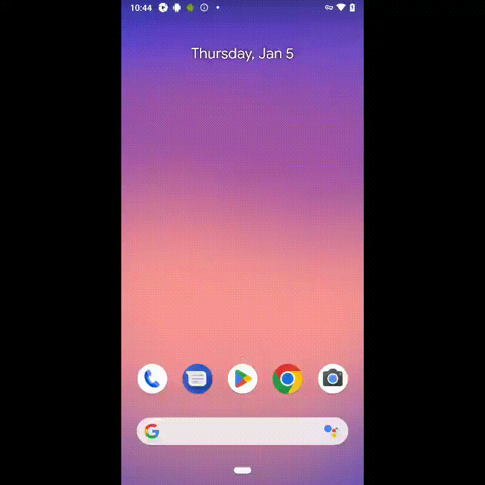

#  Test automation project for Wikipedia mobile app

##	Content

- [Technologies and tools](#technologist-technologies-and-tools)
- [Implemented checks](#bookmark_tabs-implemented-checks)
- [Running tests from the terminal](#computer-running-tests-from-the-terminal)
- [Running tests in Jenkins](#-running-tests-in-jenkins)
- [Отчет о результатах тестирования в Allure Report](#-отчет-о-результатах-тестирования-в-Allure-report)
- [Интеграция с Allure TestOps](#-интеграция-с-allure-testops)
- [Уведомления в Telegram с использованием бота](#-уведомления-в-telegram-с-использованием-бота)
- [Пример запуска теста в Browserstack](#-пример-запуска-теста-в-Browserstack)


## :technologist: Technologies and tools
<p  align="center">

<code></code>
<code></code>
<code></code>
<code></code>
<code></code>
<code></code>
<code></code>
<code></code>
<code></code>
<code></code>
<code></code>

</p>

## :bookmark_tabs: Implemented checks:

- Successful article search in the application 
- Checking if the article page matches the given input 
- Adding new language

## :computer: Running tests from the terminal

### Remote running tests

```bash
gradle clean test 
-DtestType=browserstack
```

### Local running tests

```bash
gradle clean test
-DtestType=local
```

##  Running tests in [Jenkins](https://jenkins.autotests.cloud/job/)

Для запуска сборки необходимо нажать кнопку <code><strong>*Собрать*</strong></code>.

<p align="center">
  
</p>

После выполнения сборки, в блоке <code><strong>*История сборок*</strong></code> напротив номера сборки появится
значок *Allure Report*, кликнув по которому, откроется страница с сформированным html-отчетом.

##  Test results report in [Allure Report](https://jenkins.autotests.cloud/job/)

<p align="center">
  
</p>


##  Интеграция с [Allure TestOps](https://allure.autotests.cloud/launch/18294)

### Основной дашборд

<p align="center">
  
</p>

### Список тестов с результатами прогона

<p align="center">
  
</p>

##  Уведомления в Telegram с использованием бота
После завершения сборки специальный бот, созданный в <code>Telegram</code>, автоматически обрабатывает и отправляет сообщение с отчетом о прогоне тестов.

<p align="center">


##  Пример запуска теста в Browserstack

К каждому тесту в отчете прилагается видео.

На данном видео выполняется:

- Проверка соотвествия страницы статьи заданным параметрам поиска


<p align="center">
  
</p>
