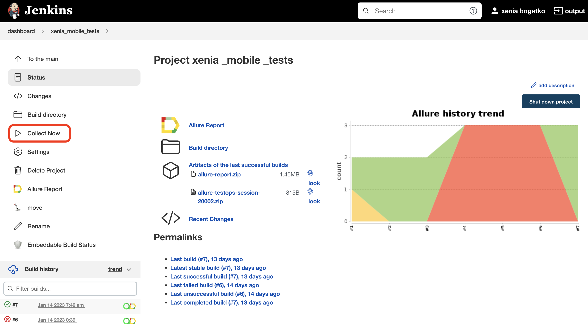
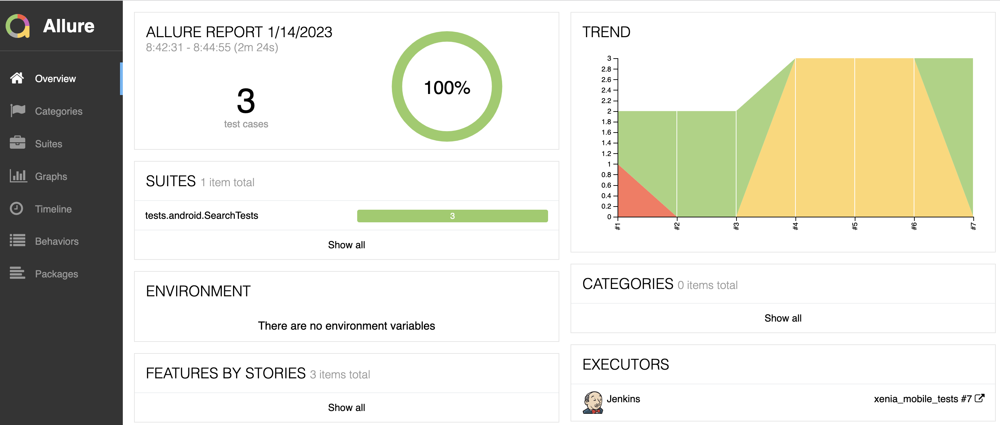
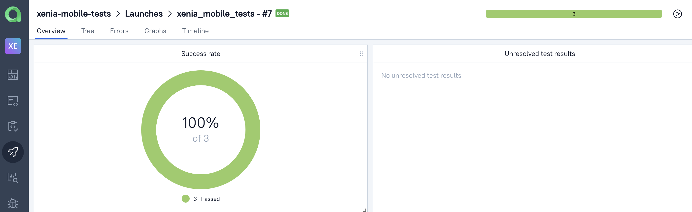
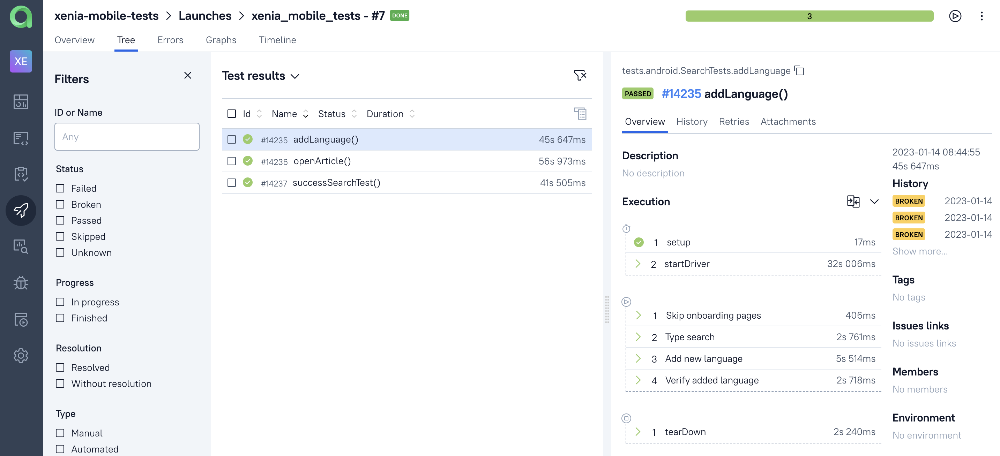
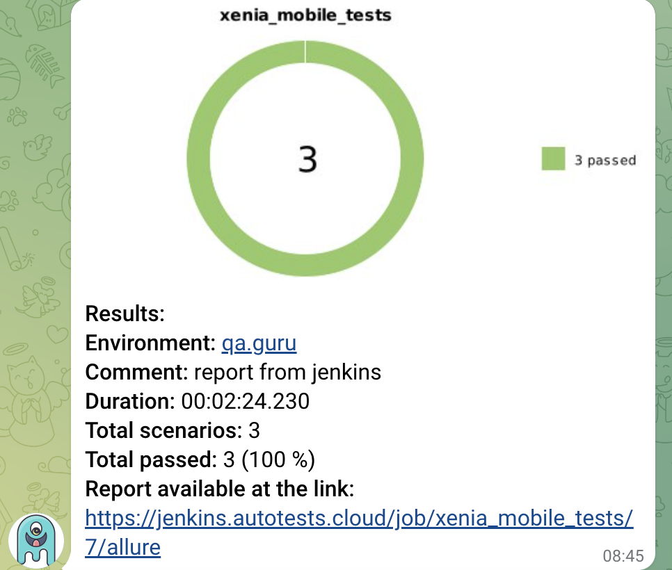

# Test automation project for Wikipedia mobile app

##	Content

- [Technologies and tools](#technologist-technologies-and-tools)
- [Implemented checks](#bookmark_tabs-implemented-checks)
- [Running tests from the terminal](#computer-running-tests-from-the-terminal)
- [Running tests in Jenkins](#-running-tests-in-jenkins)
- [Test results report in Allure Report](#-test-results-report-in-Allure-report)
- [Integration with Allure TestOps](#-integration-with-allure-testops)
- [Telegram notifications using a bot](#-telegram-notifications-using-a-bot)
- [Mobile Test running example in Browserstack](#-mobile-test-running-example-in-browserstack)

## :technologist: Technologies and tools
<p  align="center">
<code></code>
<code></code>
<code></code>
<code></code>
<code></code>
<code></code>
<code></code>
<code></code>
<code></code>
<code></code>
<code></code>
</p>

## :bookmark_tabs: Implemented checks:

- Successful article search in the application 
- Checking if the article page matches the given input 
- Adding new language

## :computer: Running tests from the terminal

### Remote running tests

```bash
gradle clean test 
-DtestType=browserstack
```

### Local running tests

```bash
gradle clean test
-DtestType=local
```

##  Running tests in [Jenkins](https://jenkins.autotests.cloud/job/xenia_mobile_tests/)

Click the button <code><strong>*Собрать*</strong></code> to start the build.

<p align="center">
  
</p>

After build is completed, in the <code><strong>*Builds history*</strong></code> opposite the build number will appear the *Allure Report* icon, clicking on which will open the page with the generated html-report.

##  Test results report in [Allure Report](https://jenkins.autotests.cloud/job/xenia_mobile_tests/7/allure/)

<p align="center">
  
</p>

##  Integration with [Allure TestOps](https://allure.autotests.cloud/launch/18302)

### Main dashboard

<p align="center">
  
</p>

### List of tests with run results

<p align="center">
  
</p>

##  Telegram notifications using a bot
After the build is completed, a special bot created in Telegram, automatically processes and sends a test run report message.

<p align="center">


##  Mobile Test running example in Browserstack

A video is attached to each test in the report.

<p align="center">
  
</p>
